<p align="center">
  <a href="http://nestjs.com/" target="blank"></a>
</p>

  <p align="center">Nien Su Viet API</p>

## Description

API for Nien Su Viet

## Database design

```mermaid
erDiagram
    User ||--o{ HistoricalEvent : "creates"
    User ||--o{ EventEdit : "edits"
    User ||--o{ BlogPost : "authors"
    User ||--o{ Image : "uploads"
    User ||--o{ KeyToken : "has"
    User }o--|| Role : "has"

    Role ||--o{ Grant : "has"
    Resource ||--o{ Grant : "has"

    HistoricalEvent ||--o{ EventEdit : "has edits"
    HistoricalEvent }o--o{ EventCategory : "categorized by"

    BlogPost }o--o| Image : "has thumbnail"

    User {
        uuid id PK
        string username UK
        string email UK
        string firstName
        string lastName
        string slug UK
        string password
        string salt
        string avatar
        string address
        date birthdate
        string msisdn
        UserSex sex
        UserStatus status
        uuid roleId FK
        timestamp createdAt
        timestamp updatedAt
    }

    Role {
        uuid id PK
        string name UK
        string slug UK
        RoleStatus status
        string description
    }

    Resource {
        uuid id PK
        string name UK
        string slug UK
        string description
    }

    Grant {
        uuid id PK
        uuid roleId FK
        uuid resourceId FK
        string action
        string attribute
    }

    HistoricalEvent {
        uuid id PK
        smallint fromDay
        smallint fromMonth
        smallint fromYear
        smallint toDay
        smallint toMonth
        smallint toYear
        text content
        uuid authorId FK
        uuid[] categoryIds
        timestamp createdAt
        timestamp updatedAt
    }

    EventCategory {
        uuid id PK
        string name UK
        string slug UK
        text description
    }

    EventEdit {
        uuid id PK
        uuid eventId FK
        uuid editorId FK
        timestamp editedAt
        text prevContent
        text newContent
        smallint prevFromDay
        smallint prevFromMonth
        smallint prevFromYear
        smallint prevToDay
        smallint prevToMonth
        smallint prevToYear
        smallint newFromDay
        smallint newFromMonth
        smallint newFromYear
        smallint newToDay
        smallint newToMonth
        smallint newToYear
    }

    EventPeriod {
        uuid id PK
        smallint fromDay
        smallint fromMonth
        smallint fromYear
        smallint toDay
        smallint toMonth
        smallint toYear
        string name UK
        string slug UK
        text description
    }

    OTP {
        uuid id PK
        string token UK
        string email
        OTPStatus status
        timestamp expiresAt
        timestamp createdAt
        timestamp updatedAt
    }

    ApiKey {
        uuid id PK
        string key UK
        boolean status
        ApiKeyPermission[] permissions
        timestamp createdAt
        timestamp updatedAt
    }

    KeyToken {
        uuid id PK
        string browserId
        text publicKey
        text privateKey
        text[] refreshTokensUsed
        text refreshToken
        uuid userId FK
        timestamp createdAt
        timestamp updatedAt
    }

    Image {
        uuid id PK
        string name
        text caption
        text description
        string url
        string link
        string type
        uuid uploaderId FK
        timestamp createdAt
        timestamp updatedAt
    }

    BlogPost {
        uuid id PK
        string title
        string slug UK
        text content
        text excerpt
        BlogStatus status
        uuid thumbnailId FK
        uuid authorId FK
        timestamp createdAt
        timestamp updatedAt
    }
```



## Project setup

```bash
$ pnpm install
$ pnpm prisma generate
$ pnpm setup:resource
$ pnpm setup:role
```

## Stay in touch

- Author - [PhanhotboY](https://twitter.com/phanhotboy)
- Website - [https://nestjs.com](https://nestjs.com/)

## License

Nest is [MIT licensed](https://github.com/nestjs/nest/blob/master/LICENSE).
